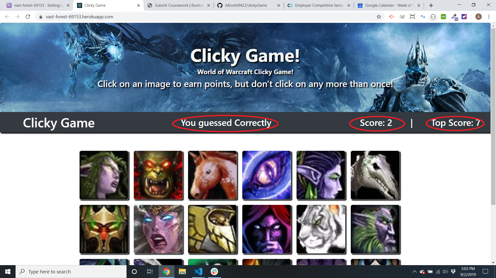

<h1 align="center">Welcome to  World of Warcraft Clicky Game   👋</h1>
<p>
  
  <a href="https://github.com/ABooth9422/clickyGame/blob/master/README.md">
    
  </a>
</p>

> World of Warcraft Clicky game with React

### 🏠 [Homepage](https://abooth9422.github.io/clickyGame/)

## Install

```sh
npm install
```

## Usage

```sh
npm start  
```
## World of Warcraft Clicky game with react!

The goal of this project is to have an understanding with react and rendering components while changing state.

This is a game! The goal of the game is to remember which icon you have clicked. If you fail to remember the 

icon that you clicked the game will start over and your score will be 0.



The outlined items with the red circle have there states being constantly changed by the user. If a user clicks

a tile that they have not clicked before there score will increase by 1 and the title will changed to "you guessed correctly".

If a user clicks on a tile that they have used before the state will change to incorrectly and there score will reset. If the

score that they got was higher than the high score the high score variable will change.

## Technologies

The technologies used for this project were:
  <ul>
  <li>React</li>
  <li>Bootstrap</li>
  </ul>

## Author

👤 **Aaron Booth  **

* Github: [@ABooth9422  ](https://github.com/ABooth9422  )

## 🤝 Contributing

Contributions, issues and feature requests are welcome!<br />Feel free to check [issues page](https://github.com/ABooth9422/clickyGame/issues).

## Show your support

Give a ⭐️ if this project helped you!

***
_This README was generated with ❤️ by [readme-md-generator](https://github.com/kefranabg/readme-md-generator)_